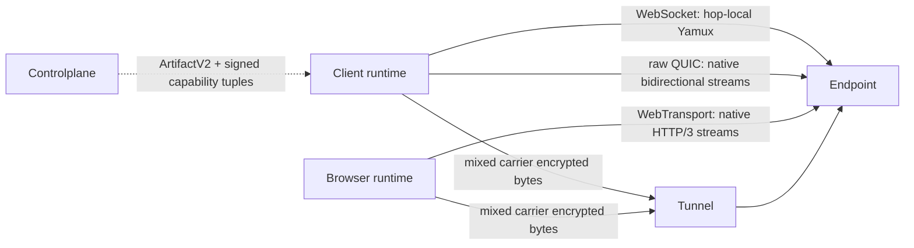

# Flowersec

<!-- readme-locales:start -->
<p align="center">
  <a href="README.md">English</a> |
  <a href="README.zh-CN.md">简体中文</a> |
  <a href="README.zh-TW.md">繁體中文</a> |
  <a href="README.ja-JP.md">日本語</a> |
  <a href="README.ko-KR.md">한국어</a> |
  <strong>Deutsch</strong> |
  <a href="README.fr-FR.md">Français</a> |
  <a href="README.es-ES.md">Español</a> |
  <a href="README.pt-BR.md">Português do Brasil</a> |
  <a href="README.ru-RU.md">Русский</a>
</p>
<!-- readme-locales:end -->

<p align="center">
  <strong>Ende-zu-Ende-verschlüsselte Kommunikation, einheitlich implementiert in Go, TypeScript, Swift und Rust.</strong>
</p>

<p align="center">
  Sichere Verbindungen zwischen Browsern, Agents und Diensten. RPC, Ereignisse, Byte-Streams, HTTP und WebSocket laufen über eine direkte oder vermittelte Sitzung, ohne dass der Relay Anwendungsdaten im Klartext sieht.
</p>

<p align="center">
  <a href="#try-it-locally">Ausprobieren</a> |
  <a href="#sdks-and-cookbooks">Cookbooks</a> |
  <a href="#portable-contract">SDKs</a> |
  <a href="#security">Sicherheit</a> |
  <a href="#deploy-and-develop">Bereitstellung</a>
</p>

[](https://github.com/floegence/flowersec/releases/latest)
[](LICENSE)


<!-- readme-section:why-flowersec -->
<a id="why-flowersec"></a>

## Warum Flowersec

- **Ein portabler Vertrag.** Go, TypeScript, Swift und Rust implementieren dasselbe Wire-Format sowie dasselbe Verhalten für Sicherheit, Sitzungen, RPC, Endpoints, Controlplane, Wiederverbindung, Proxy und Beobachtbarkeit.
- **Carrier-neutrale Pfade.** Transport v2 behandelt WebSocket, raw QUIC und WebTransport als gleichwertige Carrier. Exakte Runtime-Fähigkeiten und Produktrichtlinien wählen Kandidaten; es gibt kein dauerhaftes Primär- oder Fallback-Protokoll.
- **Eine Sitzung, viele Datenflüsse.** RPC-Aufrufe, Ereignisse, eigene Byte-Streams, HTTP-Anfragen und WebSocket-Verkehr werden über dieselbe verschlüsselte Verbindung gemultiplext.
- **Die nötigen Bausteine sind enthalten.** Flowersec liefert native Endpoint-APIs, eine TypeScript Browser Runtime, einen quelloffenen Tunnel, ein Proxy Gateway und Betriebs-CLIs.

Typische Einsatzfälle sind entfernte Agents, private Dienste, interne Web-Werkzeuge, browserbasierte Betriebskonsolen und Echtzeit-Controlplanes.

<!-- readme-section:how-it-works -->
<a id="how-it-works"></a>

## Funktionsweise

| Pfad | Verbindungsform | Vertrauensgrenze |
| --- | --- | --- |
| Direct | Der Client verbindet sich mit einem erreichbaren Server-Endpoint | Client und Endpoint terminieren E2EE; für den Datenpfad ist keine laufende Controlplane erforderlich |
| Tunnel | Client und Endpoint verbinden sich mit einmaligen Grants mit demselben Tunnel | Die Controlplane bereitet die Verbindung vor; der Tunnel ordnet die Endpunkte zu und leitet verschlüsselte Bytes weiter |
| Browser proxy | Eine Browser Runtime oder ein Gateway transportiert HTTP und WebSocket über Flowersec Streams | Der Runtime-Modus behält E2EE bis zum Endpoint bei; der Gateway-Modus vertraut dem Gateway bewusst L7-Klartext an |

Die Controlplane dient nur der Verbindungsvorbereitung. Sie stellt ConnectArtifacts und Grants aus, liegt aber nicht im Ende-zu-Ende-verschlüsselten Anwendungsdatenpfad.



Transport v2 treats WebSocket, raw QUIC, and WebTransport as equal carrier classes. WebSocket keeps hop-local Yamux; raw QUIC and WebTransport use native bidirectional streams and disable 0-RTT and QUIC DATAGRAM. The exact runtime support matrix and breaking lifecycle migration are maintained in the [Transport v2 architecture](docs/TRANSPORT_V2_ARCHITECTURE.md) and [migration guide](docs/MIGRATION_TRANSPORT_V2.md).

<!-- readme-section:try-it-locally -->
<a id="try-it-locally"></a>

## Lokal ausprobieren

Aus einem Source-Checkout das TypeScript-Paket bauen und den gemeinsamen Demo Stack starten:

```bash
make ts-ensure-deps ts-build
node ./examples/ts/dev-server.mjs | tee dev.json
```

Das erzeugte JSON enthält Browser-URLs für Direct, Tunnel und den Ende-zu-Ende Proxy Runtime sowie die Controlplane-URL für die nativen SDK-Beispiele. Release Demo Bundles enthalten die benötigten Binärdateien und das vorgebaute TypeScript-Paket.

Exakte Befehle für Go, TypeScript, Swift und Rust stehen im [Cookbook-Index](examples/README.md).

<!-- readme-section:sdks-and-cookbooks -->
<a id="sdks-and-cookbooks"></a>

## SDKs und Cookbooks

| Sprache | Paket und Installation | Cookbook |
| --- | --- | --- |
| Go | `go get github.com/floegence/flowersec/flowersec-go/v2@latest` | [Go](examples/go/README.md) |
| TypeScript | `npm install @floegence/flowersec-core` | [TypeScript](examples/ts/README.md) |
| Swift | SwiftPM-Produkt `Flowersec` | [Swift](examples/swift/README.md) |
| Rust | `cargo add flowersec` | [Rust](examples/rust/README.md) |

Neue Integrationen folgen einem sprachunabhängigen Pfad:

```text
ArtifactV2 -> equal candidate selection -> authenticated SessionV2 -> RPC / stream / proxy
```

Die Cookbooks verweisen direkt auf ausführbaren Quellcode, statt große API-Beispiele in mehreren Dokumenten zu duplizieren.

<!-- readme-section:portable-contract -->
<a id="portable-contract"></a>

## Portabler Vertrag

| Fähigkeit | Go | TypeScript | Swift | Rust |
| --- | :---: | :---: | :---: | :---: |
| Client- und Endpoint-Sitzungen | Ja | Ja | Ja | Ja |
| RPC, Ereignisse und eigene Streams | Ja | Ja | Ja | Ja |
| Controlplane-Artefakte und Wiederverbindung | Ja | Ja | Ja | Ja |
| HTTP- und WebSocket-Proxyvertrag | Ja | Ja | Ja | Ja |
| Gemeinsame Diagnosen und Ressourcenlimits | Ja | Ja | Ja | Ja |

Runtime-spezifische Zuständigkeiten bleiben klar: TypeScript besitzt die Browser- und Service-Worker-Integration, Go den gemeinsamen Tunnel, das Proxy Gateway und die CLIs. Swift und Rust liefern native SDK-Integration, ohne diese Komponenten zu duplizieren.

Die Interoperabilität wird fortlaufend in beiden Richtungen gegen Go Reference Client/Server geprüft. Das umfasst Direct, Tunnel, RPC, Streams, Liveness, Rekey, Reset und Proxy-Verkehr für TypeScript, Swift und Rust.

Die obige Tabelle beschreibt die portablen Fähigkeiten von Transport v1. Die produktiven Netzwerkfähigkeiten von Transport v2 folgen exakten Runtime Tuples.

| Transport v2 capability | Go | TypeScript | Swift | Rust |
| --- | :---: | :---: | :---: | :---: |
| WebSocket carrier | Yes | Browser: Yes / Node: No | No | No |
| raw QUIC carrier | Yes | No | No | Tested adapter; not advertised |
| WebTransport carrier | Yes | Browser: Yes / Node: No | No | No |

Lokaler Transport-v2-Smoke ist keine produktive sprachübergreifende Freigabe. Die Veröffentlichung benötigt signierte Evidenz für reale Browser, schwache Netze, qlog, Migration und Performance. Die `flowersec-tunnel` CLI und aktuelle Cookbook-Binaries bleiben Transport v1.

<!-- readme-section:security -->
<a id="security"></a>

## Sicherheit

- High-Level-Verbindungen verlangen standardmäßig `wss://`. Lokale Entwicklung mit `ws://` benötigt eine explizite Loopback Policy.
- Tunnel Grants sind nur einmal verwendbar. Eine Wiederverbindung muss ein neues `ConnectArtifact` oder einen neuen Grant abrufen.
- Nach dem E2EE-Handshake kann der Tunnel Anwendungsdaten nicht entschlüsseln. TLS schützt weiterhin Attach-Metadaten und Bearer Token vor E2EE.
- Der Browser-Runtime-Modus erhält E2EE über den Relay. Das Proxy Gateway ist bewusst eine vertrauenswürdige L7-Komponente.

Vor dem Produktiveinsatz sollten das [Bedrohungsmodell](docs/THREAT_MODEL.md), das [Protokoll](docs/PROTOCOL.md) und das [Fehlermodell](docs/ERROR_MODEL.md) geprüft werden.

<!-- readme-section:deploy-and-develop -->
<a id="deploy-and-develop"></a>

## Bereitstellung und Entwicklung

Bereitstellungsanleitungen:

- [Tunnel selbst betreiben](docs/TUNNEL_DEPLOYMENT.md)
- [Proxy Gateway bereitstellen](docs/PROXY_GATEWAY_DEPLOYMENT.md)

Repository-Struktur:

- `flowersec-go/`, `flowersec-ts/`, `flowersec-swift/`, `flowersec-rust/`: Sprach-SDKs
- `examples/`: ausführbare Cookbooks und gemeinsamer Demo Stack
- `idl/`: gemeinsame Protokolldefinitionen und Eingaben für generierte Verträge
- `docs/`: dauerhafte Protokoll-, Sicherheits-, Interoperabilitäts- und Bereitstellungsverträge

Die Repository-Hooks einmal pro Worktree installieren und vor der Integration das vollständige lokale Gate ausführen:

```bash
make install-hooks
make check
```

Flowersec steht unter der [MIT License](LICENSE). Veröffentlichte Pakete, Binärdateien, Images und Release Notes sind über [GitHub Releases](https://github.com/floegence/flowersec/releases) verfügbar.
