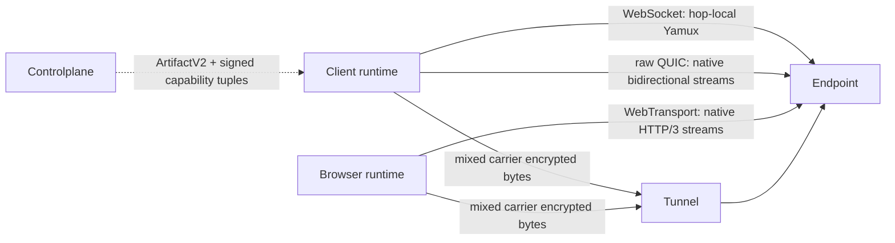

# Flowersec

<!-- readme-locales:start -->
<p align="center">
  <a href="README.md">English</a> |
  <a href="README.zh-CN.md">简体中文</a> |
  <a href="README.zh-TW.md">繁體中文</a> |
  <a href="README.ja-JP.md">日本語</a> |
  <a href="README.ko-KR.md">한국어</a> |
  <a href="README.de-DE.md">Deutsch</a> |
  <a href="README.fr-FR.md">Français</a> |
  <strong>Español</strong> |
  <a href="README.pt-BR.md">Português do Brasil</a> |
  <a href="README.ru-RU.md">Русский</a>
</p>
<!-- readme-locales:end -->

<p align="center">
  <strong>Comunicación cifrada de extremo a extremo, implementada de forma coherente en Go, TypeScript, Swift y Rust.</strong>
</p>

<p align="center">
  Crea conexiones seguras entre navegadores, Agents y servicios. Transporta RPC, eventos, flujos de bytes, HTTP y WebSocket en una sola sesión directa o con relay, sin exponer al relay el texto plano de la aplicación.
</p>

<p align="center">
  <a href="#try-it-locally">Probar</a> |
  <a href="#sdks-and-cookbooks">Cookbooks</a> |
  <a href="#portable-contract">SDK</a> |
  <a href="#security">Seguridad</a> |
  <a href="#deploy-and-develop">Desplegar</a>
</p>

[](https://github.com/floegence/flowersec/releases/latest)
[](LICENSE)


<!-- readme-section:why-flowersec -->
<a id="why-flowersec"></a>

## Por qué Flowersec

- **Un único contrato portable.** Go, TypeScript, Swift y Rust implementan el mismo formato de red y el mismo comportamiento de seguridad, sesión, RPC, Endpoint, Controlplane, reconexión, proxy y observabilidad.
- **Rutas neutrales al Carrier.** Transport v2 trata WebSocket, raw QUIC y WebTransport como Carriers equivalentes. Las capacidades Runtime exactas y la política de producto eligen candidatos, sin protocolo primario ni fallback permanente.
- **Una sesión, muchos flujos.** Multiplexa llamadas RPC, eventos, flujos de bytes personalizados, solicitudes HTTP y tráfico WebSocket sobre la misma conexión cifrada.
- **Incluye los componentes necesarios.** Flowersec proporciona API Endpoint nativas, un Browser Runtime TypeScript, un Tunnel de código abierto, un Proxy Gateway y CLI operativas.

Los usos habituales incluyen Agents remotos, servicios privados, herramientas Web internas, consolas de operación en el navegador y Controlplanes en tiempo real.

<!-- readme-section:how-it-works -->
<a id="how-it-works"></a>

## Cómo funciona

| Ruta | Forma de conexión | Límite de confianza |
| --- | --- | --- |
| Direct | El cliente se conecta a un Endpoint de servidor accesible | El cliente y el Endpoint terminan E2EE; no se necesita una Controlplane en línea en la ruta de datos |
| Tunnel | El cliente y el Endpoint se conectan al mismo Tunnel mediante Grants de un solo uso | La Controlplane prepara la conexión; el Tunnel empareja los extremos y reenvía bytes cifrados |
| Browser proxy | Un Browser Runtime o Gateway transporta HTTP y WebSocket mediante Flowersec Streams | El modo Runtime conserva E2EE hasta el Endpoint; el modo Gateway confía deliberadamente al Gateway el texto plano L7 |

La Controlplane solo prepara la conexión. Emite ConnectArtifacts y Grants, pero no forma parte de la ruta de datos de aplicación cifrada de extremo a extremo.



Transport v2 treats WebSocket, raw QUIC, and WebTransport as equal carrier classes. WebSocket keeps hop-local Yamux; raw QUIC and WebTransport use native bidirectional streams and disable 0-RTT and QUIC DATAGRAM. The exact runtime support matrix and breaking lifecycle migration are maintained in the [Transport v2 architecture](docs/TRANSPORT_V2_ARCHITECTURE.md) and [migration guide](docs/MIGRATION_TRANSPORT_V2.md).

<!-- readme-section:try-it-locally -->
<a id="try-it-locally"></a>

## Probar en local

Desde una copia del código fuente, compila el paquete TypeScript e inicia la Demo Stack compartida:

```bash
make ts-ensure-deps ts-build
node ./examples/ts/dev-server.mjs | tee dev.json
```

El JSON generado contiene las URL de navegador para Direct, Tunnel y Proxy Runtime de extremo a extremo, además de la URL de Controlplane utilizada por los ejemplos de SDK nativos. Los Release Demo Bundles incluyen los binarios necesarios y el paquete TypeScript precompilado.

Consulta el [índice de Cookbooks](examples/README.md) para ver los comandos exactos de Go, TypeScript, Swift y Rust.

<!-- readme-section:sdks-and-cookbooks -->
<a id="sdks-and-cookbooks"></a>

## SDK y Cookbooks

| Lenguaje | Paquete e instalación | Cookbook |
| --- | --- | --- |
| Go | `go get github.com/floegence/flowersec/flowersec-go/v2@latest` | [Go](examples/go/README.md) |
| TypeScript | `npm install @floegence/flowersec-core` | [TypeScript](examples/ts/README.md) |
| Swift | Producto SwiftPM `Flowersec` | [Swift](examples/swift/README.md) |
| Rust | `cargo add flowersec` | [Rust](examples/rust/README.md) |

Las integraciones nuevas siguen una única ruta independiente del lenguaje:

```text
ArtifactV2 -> equal candidate selection -> authenticated SessionV2 -> RPC / stream / proxy
```

Los Cookbooks enlazan directamente con código ejecutable en lugar de duplicar grandes ejemplos de API en varios documentos.

<!-- readme-section:portable-contract -->
<a id="portable-contract"></a>

## Contrato portable

| Capacidad | Go | TypeScript | Swift | Rust |
| --- | :---: | :---: | :---: | :---: |
| Sesiones Client y Endpoint | Sí | Sí | Sí | Sí |
| RPC, eventos y Streams personalizados | Sí | Sí | Sí | Sí |
| Artifacts de Controlplane y reconexión | Sí | Sí | Sí | Sí |
| Contrato Proxy HTTP y WebSocket | Sí | Sí | Sí | Sí |
| Diagnósticos compartidos y límites de recursos | Sí | Sí | Sí | Sí |

Las responsabilidades específicas de Runtime son explícitas: TypeScript mantiene la integración Browser y Service Worker; Go mantiene el Tunnel compartido, Proxy Gateway y las CLI; Swift y Rust proporcionan integración SDK nativa sin duplicar esos componentes.

La interoperabilidad se comprueba continuamente en ambas direcciones con Go Reference Client/Server para TypeScript, Swift y Rust, cubriendo Direct, Tunnel, RPC, Streams, Liveness, Rekey, Reset y tráfico Proxy.

La tabla anterior describe las capacidades portables de Transport v1. Las capacidades de red de producción de Transport v2 siguen Runtime Tuples exactos.

| Transport v2 capability | Go | TypeScript | Swift | Rust |
| --- | :---: | :---: | :---: | :---: |
| WebSocket carrier | Yes | Browser: Yes / Node: No | No | No |
| raw QUIC carrier | Yes | No | No | Tested adapter; not advertised |
| WebTransport carrier | Yes | Browser: Yes / Node: No | No | No |

El smoke local de Transport v2 no es una aprobación de producción entre lenguajes. La release requiere evidencia firmada de navegador real, red débil, qlog, migración y rendimiento. La CLI `flowersec-tunnel` y los binarios Cookbook actuales siguen siendo Transport v1.

<!-- readme-section:security -->
<a id="security"></a>

## Seguridad

- Las conexiones de alto nivel exigen `wss://` por defecto. El desarrollo local con `ws://` requiere una Loopback Policy explícita.
- Los Tunnel Grants son de un solo uso. Una reconexión debe obtener un nuevo `ConnectArtifact` o Grant.
- Tras el handshake E2EE, el Tunnel no puede descifrar los datos de la aplicación. TLS sigue protegiendo los metadatos de conexión y Bearer Tokens anteriores a E2EE.
- El modo Browser Runtime conserva E2EE a través del relay. El Proxy Gateway es deliberadamente un componente L7 de confianza.

Antes de usarlo en producción, revisa el [modelo de amenazas](docs/THREAT_MODEL.md), el [protocolo](docs/PROTOCOL.md) y el [modelo de errores](docs/ERROR_MODEL.md).

<!-- readme-section:deploy-and-develop -->
<a id="deploy-and-develop"></a>

## Despliegue y desarrollo

Guías de despliegue:

- [Autoalojar el Tunnel](docs/TUNNEL_DEPLOYMENT.md)
- [Desplegar el Proxy Gateway](docs/PROXY_GATEWAY_DEPLOYMENT.md)

Estructura del repositorio:

- `flowersec-go/`, `flowersec-ts/`, `flowersec-swift/`, `flowersec-rust/`: SDK por lenguaje
- `examples/`: Cookbooks ejecutables y Demo Stack compartida
- `idl/`: definiciones de protocolo compartidas y entradas de contratos generados
- `docs/`: contratos duraderos de protocolo, seguridad, interoperabilidad y despliegue

Instala los Hooks administrados por el repositorio una vez en cada Worktree y ejecuta el control local completo antes de integrar:

```bash
make install-hooks
make check
```

Flowersec se distribuye bajo [MIT License](LICENSE). Los paquetes, binarios, imágenes y Release Notes publicados están disponibles en [GitHub Releases](https://github.com/floegence/flowersec/releases).
