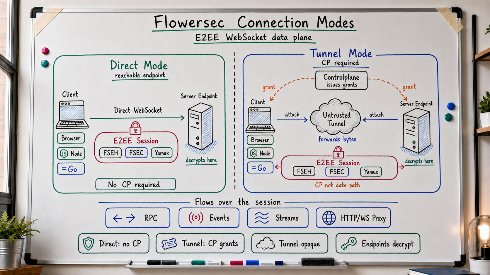

# Flowersec

<!-- readme-locales:start -->
<p align="center">
  <a href="README.md">English</a> |
  <a href="README.zh-CN.md">简体中文</a> |
  <a href="README.zh-TW.md">繁體中文</a> |
  <a href="README.ja-JP.md">日本語</a> |
  <a href="README.ko-KR.md">한국어</a> |
  <a href="README.de-DE.md">Deutsch</a> |
  <strong>Français</strong> |
  <a href="README.es-ES.md">Español</a> |
  <a href="README.pt-BR.md">Português do Brasil</a> |
  <a href="README.ru-RU.md">Русский</a>
</p>
<!-- readme-locales:end -->

<p align="center">
  <strong>Communication chiffrée de bout en bout, implémentée de manière cohérente en Go, TypeScript, Swift et Rust.</strong>
</p>

<p align="center">
  Établissez des connexions sécurisées entre navigateurs, Agents et services. Transportez RPC, événements, flux d'octets, HTTP et WebSocket dans une seule session directe ou relayée, sans exposer le texte en clair de l'application au relais.
</p>

<p align="center">
  <a href="#try-it-locally">Essayer</a> |
  <a href="#sdks-and-cookbooks">Cookbooks</a> |
  <a href="#portable-contract">SDK</a> |
  <a href="#security">Sécurité</a> |
  <a href="#deploy-and-develop">Déployer</a>
</p>

[](https://github.com/floegence/flowersec/releases/latest)
[](LICENSE)


<!-- readme-section:why-flowersec -->
<a id="why-flowersec"></a>

## Pourquoi Flowersec

- **Un contrat portable unique.** Go, TypeScript, Swift et Rust implémentent le même format filaire et les mêmes comportements de sécurité, session, RPC, Endpoint, Controlplane, reconnexion, proxy et observabilité.
- **Connexion directe ou relayée.** Utilisez le chemin WebSocket direct le plus court lorsque l'Endpoint est accessible, ou un Tunnel auto-hébergé sans lui révéler le texte en clair de l'application.
- **Une session, plusieurs flux.** Multiplexez les appels RPC, événements, flux d'octets personnalisés, requêtes HTTP et trafic WebSocket sur la même connexion chiffrée.
- **Les composants utiles sont inclus.** Flowersec fournit des API Endpoint natives, un Browser Runtime TypeScript, un Tunnel open source, un Proxy Gateway et des CLI d'exploitation.

Les usages courants comprennent les Agents distants, les services privés, les outils Web internes, les consoles d'exploitation dans le navigateur et les Controlplanes temps réel.

<!-- readme-section:how-it-works -->
<a id="how-it-works"></a>

## Fonctionnement

| Chemin | Forme de connexion | Frontière de confiance |
| --- | --- | --- |
| Direct | Le client se connecte à un Endpoint serveur accessible | Le client et l'Endpoint terminent E2EE ; aucune Controlplane en ligne n'est nécessaire dans le chemin de données |
| Tunnel | Le client et l'Endpoint rejoignent le même Tunnel avec des Grants à usage unique | La Controlplane prépare la connexion ; le Tunnel associe les extrémités et transfère des octets chiffrés |
| Browser proxy | Un Browser Runtime ou une Gateway transporte HTTP et WebSocket sur des Flowersec Streams | Le mode Runtime conserve E2EE jusqu'à l'Endpoint ; le mode Gateway confie volontairement le texte en clair L7 à la Gateway |

La Controlplane sert uniquement à préparer la connexion. Elle émet les ConnectArtifacts et Grants, mais ne se trouve pas dans le chemin des données applicatives chiffrées de bout en bout.



<!-- readme-section:try-it-locally -->
<a id="try-it-locally"></a>

## Essai local

Depuis une copie des sources, construisez le paquet TypeScript et lancez la Demo Stack partagée :

```bash
make ts-ensure-deps ts-build
node ./examples/ts/dev-server.mjs | tee dev.json
```

Le JSON généré contient les URL navigateur des modes Direct, Tunnel et Proxy Runtime de bout en bout, ainsi que l'URL Controlplane utilisée par les exemples SDK natifs. Les Release Demo Bundles incluent les binaires requis et le paquet TypeScript précompilé.

Consultez l'[index des Cookbooks](examples/README.md) pour les commandes exactes Go, TypeScript, Swift et Rust.

<!-- readme-section:sdks-and-cookbooks -->
<a id="sdks-and-cookbooks"></a>

## SDK et Cookbooks

| Langage | Paquet et installation | Cookbook |
| --- | --- | --- |
| Go | `go get github.com/floegence/flowersec/flowersec-go@latest` | [Go](examples/go/README.md) |
| TypeScript | `npm install @floegence/flowersec-core` | [TypeScript](examples/ts/README.md) |
| Swift | Produit SwiftPM `Flowersec` | [Swift](examples/swift/README.md) |
| Rust | `cargo add flowersec` | [Rust](examples/rust/README.md) |

Les nouvelles intégrations suivent un chemin unique indépendant du langage :

```text
ConnectArtifact -> connect -> RPC / stream / proxy
```

Les Cookbooks pointent directement vers du code exécutable au lieu de dupliquer de grands exemples d'API dans plusieurs documents.

<!-- readme-section:portable-contract -->
<a id="portable-contract"></a>

## Contrat portable

| Capacité | Go | TypeScript | Swift | Rust |
| --- | :---: | :---: | :---: | :---: |
| Sessions Client et Endpoint | Oui | Oui | Oui | Oui |
| RPC, événements et Streams personnalisés | Oui | Oui | Oui | Oui |
| Artifacts Controlplane et reconnexion | Oui | Oui | Oui | Oui |
| Contrat Proxy HTTP et WebSocket | Oui | Oui | Oui | Oui |
| Diagnostics partagés et limites de ressources | Oui | Oui | Oui | Oui |

Les responsabilités propres aux Runtimes restent explicites : TypeScript possède l'intégration Browser et Service Worker ; Go possède le Tunnel partagé, le Proxy Gateway et les CLI ; Swift et Rust fournissent une intégration SDK native sans dupliquer ces composants.

L'interopérabilité est vérifiée en continu dans les deux directions avec le Go Reference Client/Server pour TypeScript, Swift et Rust, notamment Direct, Tunnel, RPC, Streams, Liveness, Rekey, Reset et trafic Proxy.

<!-- readme-section:security -->
<a id="security"></a>

## Sécurité

- Les connexions de haut niveau exigent `wss://` par défaut. Le développement local en `ws://` nécessite une Loopback Policy explicite.
- Les Tunnel Grants sont à usage unique. Une reconnexion doit récupérer un nouveau `ConnectArtifact` ou Grant.
- Après le handshake E2EE, le Tunnel ne peut pas déchiffrer les données applicatives. TLS protège néanmoins les métadonnées d'attachement et Bearer Tokens antérieurs à E2EE.
- Le mode Browser Runtime conserve E2EE à travers le relais. Le Proxy Gateway est volontairement un composant L7 de confiance.

Avant une utilisation en production, consultez le [modèle de menace](docs/THREAT_MODEL.md), le [protocole](docs/PROTOCOL.md) et le [modèle d'erreur](docs/ERROR_MODEL.md).

<!-- readme-section:deploy-and-develop -->
<a id="deploy-and-develop"></a>

## Déploiement et développement

Guides de déploiement :

- [Auto-héberger le Tunnel](docs/TUNNEL_DEPLOYMENT.md)
- [Déployer le Proxy Gateway](docs/PROXY_GATEWAY_DEPLOYMENT.md)

Organisation du dépôt :

- `flowersec-go/`, `flowersec-ts/`, `flowersec-swift/`, `flowersec-rust/` : SDK par langage
- `examples/` : Cookbooks exécutables et Demo Stack partagée
- `idl/` : définitions de protocole partagées et entrées des contrats générés
- `docs/` : contrats durables de protocole, sécurité, interopérabilité et déploiement

Installez les Hooks gérés par le dépôt une fois dans chaque Worktree, puis exécutez le contrôle local complet avant intégration :

```bash
make install-hooks
make check
```

Flowersec est distribué sous [MIT License](LICENSE). Les paquets, binaires, images et Release Notes publiés sont disponibles dans [GitHub Releases](https://github.com/floegence/flowersec/releases).
