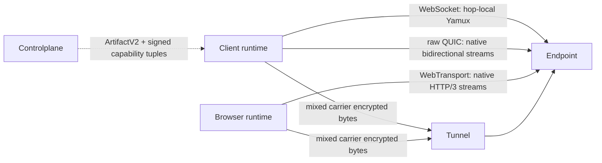

# Flowersec

<!-- readme-locales:start -->
<p align="center">
  <a href="README.md">English</a> |
  <a href="README.zh-CN.md">简体中文</a> |
  <a href="README.zh-TW.md">繁體中文</a> |
  <strong>日本語</strong> |
  <a href="README.ko-KR.md">한국어</a> |
  <a href="README.de-DE.md">Deutsch</a> |
  <a href="README.fr-FR.md">Français</a> |
  <a href="README.es-ES.md">Español</a> |
  <a href="README.pt-BR.md">Português do Brasil</a> |
  <a href="README.ru-RU.md">Русский</a>
</p>
<!-- readme-locales:end -->

<p align="center">
  <strong>Go、TypeScript、Swift、Rust で一貫して実装されたエンドツーエンド暗号化通信。</strong>
</p>

<p align="center">
  ブラウザー、Agent、サービス間に安全な接続を構築します。RPC、イベント、バイトストリーム、HTTP、WebSocket を 1 つの直接または中継セッションで運び、中継側にアプリケーションの平文を公開しません。
</p>

<p align="center">
  <a href="#try-it-locally">試す</a> |
  <a href="#sdks-and-cookbooks">Cookbook</a> |
  <a href="#portable-contract">SDK</a> |
  <a href="#security">セキュリティ</a> |
  <a href="#deploy-and-develop">デプロイ</a>
</p>

[](https://github.com/floegence/flowersec/releases/latest)
[](LICENSE)


<!-- readme-section:why-flowersec -->
<a id="why-flowersec"></a>

## Flowersec を選ぶ理由

- **1 つのポータブル契約。** Go、TypeScript、Swift、Rust は、同じワイヤー形式、セキュリティ、セッション、RPC、Endpoint、Controlplane、再接続、プロキシ、可観測性の動作を実装します。
- **Carrier に中立な経路。** Transport v2 は WebSocket、raw QUIC、WebTransport を同等の Carrier として扱い、正確な Runtime 能力と製品ポリシーで候補を選択します。恒久的な主プロトコルやフォールバックはありません。
- **1 セッションで複数のフロー。** RPC 呼び出し、イベント、カスタムバイトストリーム、HTTP リクエスト、WebSocket トラフィックを同じ暗号化接続上で多重化します。
- **必要な構成要素を同梱。** ネイティブ Endpoint API、TypeScript ブラウザー Runtime、オープンソース Tunnel、Proxy Gateway、運用 CLI を提供します。

代表的な用途は、リモート Agent、プライベートサービス、社内 Web ツール、ブラウザー運用コンソール、リアルタイム Controlplane です。

<!-- readme-section:how-it-works -->
<a id="how-it-works"></a>

## 仕組み

| 経路 | 接続形態 | 信頼境界 |
| --- | --- | --- |
| Direct | クライアントが到達可能なサーバー Endpoint に接続 | クライアントと Endpoint が E2EE を終端し、データ経路にオンライン Controlplane は不要 |
| Tunnel | クライアントと Endpoint がワンタイム Grant で同じ Tunnel に接続 | Controlplane が接続を準備し、Tunnel はエンドポイントを組み合わせて暗号化バイトを転送 |
| Browser proxy | ブラウザー Runtime または Gateway が Flowersec Stream 上で HTTP と WebSocket を転送 | Runtime モードはブラウザーから Endpoint まで E2EE を維持し、Gateway モードは意図的に Gateway を L7 平文の信頼境界にする |

Controlplane は接続準備のみに関与します。ConnectArtifact と Grant を発行しますが、エンドツーエンドで暗号化されたアプリケーションデータ経路には入りません。



Transport v2 treats WebSocket, raw QUIC, and WebTransport as equal carrier classes. WebSocket keeps hop-local Yamux; raw QUIC and WebTransport use native bidirectional streams and disable 0-RTT and QUIC DATAGRAM. The exact runtime support matrix and breaking lifecycle migration are maintained in the [Transport v2 architecture](docs/TRANSPORT_V2_ARCHITECTURE.md) and [migration guide](docs/MIGRATION_TRANSPORT_V2.md).

<!-- readme-section:try-it-locally -->
<a id="try-it-locally"></a>

## ローカルで試す

ソースチェックアウトから TypeScript パッケージをビルドし、共有 Demo Stack を起動します。

```bash
make ts-ensure-deps ts-build
node ./examples/ts/dev-server.mjs | tee dev.json
```

生成される JSON には、Direct、Tunnel、エンドツーエンド Proxy Runtime のブラウザー URL と、ネイティブ SDK サンプルが利用する Controlplane URL が含まれます。Release Demo Bundle には必要なバイナリとビルド済み TypeScript パッケージが含まれます。

Go、TypeScript、Swift、Rust の正確なコマンドは [Cookbook インデックス](examples/README.md)を参照してください。

<!-- readme-section:sdks-and-cookbooks -->
<a id="sdks-and-cookbooks"></a>

## SDK と Cookbook

| 言語 | パッケージとインストール | Cookbook |
| --- | --- | --- |
| Go | `go get github.com/floegence/flowersec/flowersec-go/v2@latest` | [Go](examples/go/README.md) |
| TypeScript | `npm install @floegence/flowersec-core` | [TypeScript](examples/ts/README.md) |
| Swift | SwiftPM プロダクト `Flowersec` | [Swift](examples/swift/README.md) |
| Rust | `cargo add flowersec` | [Rust](examples/rust/README.md) |

新しい統合は、言語に依存しない 1 つの経路を使用します。

```text
ArtifactV2 -> equal candidate selection -> authenticated SessionV2 -> RPC / stream / proxy
```

Cookbook は実行可能なソースへ直接リンクし、複数の文書に大きな API サンプルを重複させません。

<!-- readme-section:portable-contract -->
<a id="portable-contract"></a>

## ポータブル契約

| 機能 | Go | TypeScript | Swift | Rust |
| --- | :---: | :---: | :---: | :---: |
| Client と Endpoint セッション | 対応 | 対応 | 対応 | 対応 |
| RPC、イベント、カスタム Stream | 対応 | 対応 | 対応 | 対応 |
| Controlplane Artifact と再接続 | 対応 | 対応 | 対応 | 対応 |
| HTTP と WebSocket Proxy 契約 | 対応 | 対応 | 対応 | 対応 |
| 共有診断とリソース制限 | 対応 | 対応 | 対応 | 対応 |

Runtime 固有の責務は明確です。TypeScript は Browser と Service Worker の統合、Go は共有 Tunnel、Proxy Gateway、CLI を担当します。Swift と Rust は、それらを重複実装せずネイティブ SDK 統合を提供します。

相互運用性は Go Reference Client/Server を基準に TypeScript、Swift、Rust の双方向を継続検証し、Direct、Tunnel、RPC、Stream、Liveness、Rekey、Reset、Proxy トラフィックを対象とします。

上の表は Transport v1 のポータブル能力です。Transport v2 の本番ネットワーク能力は正確な Runtime Tuple に従います。

| Transport v2 capability | Go | TypeScript | Swift | Rust |
| --- | :---: | :---: | :---: | :---: |
| WebSocket carrier | Yes | Browser: Yes / Node: No | No | No |
| raw QUIC carrier | Yes | No | No | Tested adapter; not advertised |
| WebTransport carrier | Yes | Browser: Yes / Node: No | No | No |

Transport v2 の local smoke はクロス言語の本番承認ではありません。リリースには実ブラウザー、弱いネットワーク、qlog、移行、性能の署名 Evidence が必要です。`flowersec-tunnel` CLI と現在の Cookbook Binary は Transport v1 のままです。

<!-- readme-section:security -->
<a id="security"></a>

## セキュリティ

- 高レベル接続は既定で `wss://` を要求します。ローカルの `ws://` 開発には明示的な Loopback Policy が必要です。
- Tunnel Grant は 1 回だけ使用できます。再接続には新しい `ConnectArtifact` または Grant が必要です。
- E2EE ハンドシェイク後、Tunnel はアプリケーションペイロードを復号できません。ただし E2EE 前の接続メタデータと Bearer Token の保護には TLS が必要です。
- Browser Runtime モードは中継経路上でも E2EE を維持します。Proxy Gateway は設計上、信頼される L7 コンポーネントです。

本番利用前に[脅威モデル](docs/THREAT_MODEL.md)、[プロトコル](docs/PROTOCOL.md)、[エラーモデル](docs/ERROR_MODEL.md)を確認してください。

<!-- readme-section:deploy-and-develop -->
<a id="deploy-and-develop"></a>

## デプロイと開発

デプロイガイド：

- [Tunnel をセルフホスト](docs/TUNNEL_DEPLOYMENT.md)
- [Proxy Gateway をデプロイ](docs/PROXY_GATEWAY_DEPLOYMENT.md)

リポジトリ構成：

- `flowersec-go/`、`flowersec-ts/`、`flowersec-swift/`、`flowersec-rust/`：各言語 SDK
- `examples/`：実行可能な Cookbook と共有 Demo Stack
- `idl/`：共有プロトコル定義と生成契約の入力
- `docs/`：長期的なプロトコル、セキュリティ、相互運用性、デプロイ契約

各 Worktree でリポジトリ管理 Hooks を 1 回インストールし、統合前に完全なローカルゲートを実行します。

```bash
make install-hooks
make check
```

Flowersec は [MIT License](LICENSE) で提供されます。公開済みパッケージ、バイナリ、イメージ、Release Notes は [GitHub Releases](https://github.com/floegence/flowersec/releases) から取得できます。
