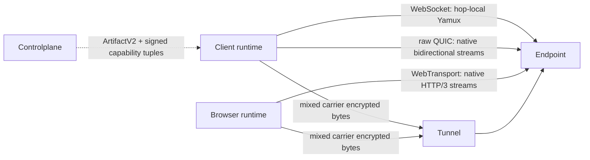

# Flowersec

<!-- readme-locales:start -->
<p align="center">
  <a href="README.md">English</a> |
  <a href="README.zh-CN.md">简体中文</a> |
  <a href="README.zh-TW.md">繁體中文</a> |
  <a href="README.ja-JP.md">日本語</a> |
  <strong>한국어</strong> |
  <a href="README.de-DE.md">Deutsch</a> |
  <a href="README.fr-FR.md">Français</a> |
  <a href="README.es-ES.md">Español</a> |
  <a href="README.pt-BR.md">Português do Brasil</a> |
  <a href="README.ru-RU.md">Русский</a>
</p>
<!-- readme-locales:end -->

<p align="center">
  <strong>Go, TypeScript, Swift, Rust에서 일관되게 구현된 종단 간 암호화 통신.</strong>
</p>

<p align="center">
  브라우저, Agent, 서비스 사이에 안전한 연결을 구축합니다. 하나의 직접 또는 중계 세션으로 RPC, 이벤트, 바이트 스트림, HTTP, WebSocket을 전달하면서 중계 서버가 애플리케이션 평문을 볼 수 없게 합니다.
</p>

<p align="center">
  <a href="#try-it-locally">직접 실행</a> |
  <a href="#sdks-and-cookbooks">Cookbook</a> |
  <a href="#portable-contract">SDK</a> |
  <a href="#security">보안</a> |
  <a href="#deploy-and-develop">배포</a>
</p>

[](https://github.com/floegence/flowersec/releases/latest)
[](LICENSE)


<!-- readme-section:why-flowersec -->
<a id="why-flowersec"></a>

## Flowersec을 선택하는 이유

- **하나의 이식 가능한 계약.** Go, TypeScript, Swift, Rust가 동일한 와이어 형식, 보안, 세션, RPC, Endpoint, Controlplane, 재연결, 프록시, 관측 가능성 동작을 구현합니다.
- **Carrier 중립 경로.** Transport v2는 WebSocket, raw QUIC, WebTransport를 동등한 Carrier로 취급하며 정확한 Runtime 기능과 제품 정책으로 후보를 선택합니다. 영구 주 프로토콜이나 fallback은 없습니다.
- **하나의 세션, 여러 흐름.** RPC 호출, 이벤트, 사용자 정의 바이트 스트림, HTTP 요청, WebSocket 트래픽을 동일한 암호화 연결에서 다중화합니다.
- **필요한 구성 요소 제공.** 네이티브 Endpoint API, TypeScript 브라우저 Runtime, 오픈 소스 Tunnel, Proxy Gateway, 운영 CLI를 제공합니다.

주요 사용 사례는 원격 Agent, 비공개 서비스, 내부 Web 도구, 브라우저 운영 콘솔, 실시간 Controlplane입니다.

<!-- readme-section:how-it-works -->
<a id="how-it-works"></a>

## 동작 방식

| 경로 | 연결 형태 | 신뢰 경계 |
| --- | --- | --- |
| Direct | 클라이언트가 접근 가능한 서버 Endpoint에 연결 | 클라이언트와 Endpoint가 E2EE를 종료하며 데이터 경로에 온라인 Controlplane이 필요하지 않음 |
| Tunnel | 클라이언트와 Endpoint가 일회용 Grant로 같은 Tunnel에 연결 | Controlplane이 연결을 준비하고 Tunnel은 엔드포인트를 연결해 암호화된 바이트를 전달 |
| Browser proxy | 브라우저 Runtime 또는 Gateway가 Flowersec Stream으로 HTTP와 WebSocket을 전달 | Runtime 모드는 브라우저부터 Endpoint까지 E2EE를 유지하고 Gateway 모드는 의도적으로 Gateway를 L7 평문 신뢰 경계로 사용 |

Controlplane은 연결 준비에만 참여합니다. ConnectArtifact와 Grant를 발급하지만 종단 간 암호화된 애플리케이션 데이터 경로에는 포함되지 않습니다.



Transport v2 treats WebSocket, raw QUIC, and WebTransport as equal carrier classes. WebSocket keeps hop-local Yamux; raw QUIC and WebTransport use native bidirectional streams and disable 0-RTT and QUIC DATAGRAM. The exact runtime support matrix and breaking lifecycle migration are maintained in the [Transport v2 architecture](docs/TRANSPORT_V2_ARCHITECTURE.md) and [migration guide](docs/MIGRATION_TRANSPORT_V2.md).

<!-- readme-section:try-it-locally -->
<a id="try-it-locally"></a>

## 로컬에서 실행

소스 체크아웃에서 TypeScript 패키지를 빌드하고 공유 Demo Stack을 시작합니다.

```bash
make ts-ensure-deps ts-build
node ./examples/ts/dev-server.mjs | tee dev.json
```

생성된 JSON에는 Direct, Tunnel, 종단 간 Proxy Runtime 브라우저 URL과 네이티브 SDK 예제가 사용하는 Controlplane URL이 포함됩니다. Release Demo Bundle에는 필요한 바이너리와 미리 빌드된 TypeScript 패키지가 포함됩니다.

정확한 Go, TypeScript, Swift, Rust 명령은 [Cookbook 인덱스](examples/README.md)를 참조하세요.

<!-- readme-section:sdks-and-cookbooks -->
<a id="sdks-and-cookbooks"></a>

## SDK와 Cookbook

| 언어 | 패키지 및 설치 | Cookbook |
| --- | --- | --- |
| Go | `go get github.com/floegence/flowersec/flowersec-go@latest` | [Go](examples/go/README.md) |
| TypeScript | `npm install @floegence/flowersec-core` | [TypeScript](examples/ts/README.md) |
| Swift | SwiftPM 제품 `Flowersec` | [Swift](examples/swift/README.md) |
| Rust | `cargo add flowersec` | [Rust](examples/rust/README.md) |

새로운 통합은 언어와 무관한 하나의 경로를 따릅니다.

```text
ArtifactV2 -> equal candidate selection -> authenticated SessionV2 -> RPC / stream / proxy
```

Cookbook은 실행 가능한 소스로 직접 연결하여 여러 문서에 큰 API 예제를 중복하지 않습니다.

<!-- readme-section:portable-contract -->
<a id="portable-contract"></a>

## 이식 가능한 계약

| 기능 | Go | TypeScript | Swift | Rust |
| --- | :---: | :---: | :---: | :---: |
| Client 및 Endpoint 세션 | 지원 | 지원 | 지원 | 지원 |
| RPC, 이벤트, 사용자 정의 Stream | 지원 | 지원 | 지원 | 지원 |
| Controlplane Artifact 및 재연결 | 지원 | 지원 | 지원 | 지원 |
| HTTP 및 WebSocket Proxy 계약 | 지원 | 지원 | 지원 | 지원 |
| 공유 진단 및 리소스 제한 | 지원 | 지원 | 지원 | 지원 |

Runtime별 책임은 명확합니다. TypeScript는 Browser 및 Service Worker 통합을, Go는 공유 Tunnel, Proxy Gateway, CLI를 담당합니다. Swift와 Rust는 이를 중복 구현하지 않고 네이티브 SDK 통합을 제공합니다.

상호 운용성은 Go Reference Client/Server를 기준으로 TypeScript, Swift, Rust의 양방향 연결을 지속적으로 검증하며 Direct, Tunnel, RPC, Stream, Liveness, Rekey, Reset, Proxy 트래픽을 포함합니다.

위 표는 Transport v1의 이식 가능한 기능입니다. Transport v2의 프로덕션 네트워크 기능은 정확한 Runtime Tuple을 따릅니다.

| Transport v2 capability | Go | TypeScript | Swift | Rust |
| --- | :---: | :---: | :---: | :---: |
| WebSocket carrier | Yes | Browser: Yes / Node: No | No | No |
| raw QUIC carrier | Yes | No | No | Tested adapter; not advertised |
| WebTransport carrier | Yes | Browser: Yes / Node: No | No | No |

Transport v2 local smoke는 언어 간 프로덕션 승인과 같지 않습니다. 릴리스에는 실제 브라우저, 약한 네트워크, qlog, 마이그레이션, 성능 서명 Evidence가 필요합니다. `flowersec-tunnel` CLI와 현재 Cookbook Binary는 Transport v1입니다.

<!-- readme-section:security -->
<a id="security"></a>

## 보안

- 고수준 연결은 기본적으로 `wss://`를 요구합니다. 로컬 `ws://` 개발에는 명시적인 Loopback Policy가 필요합니다.
- Tunnel Grant는 한 번만 사용할 수 있습니다. 재연결에는 새로운 `ConnectArtifact` 또는 Grant가 필요합니다.
- E2EE 핸드셰이크 이후 Tunnel은 애플리케이션 페이로드를 복호화할 수 없습니다. 하지만 E2EE 이전 연결 메타데이터와 Bearer Token 보호에는 TLS가 필요합니다.
- Browser Runtime 모드는 중계 경로에서도 E2EE를 유지합니다. Proxy Gateway는 설계상 신뢰되는 L7 구성 요소입니다.

프로덕션 사용 전에 [위협 모델](docs/THREAT_MODEL.md), [프로토콜](docs/PROTOCOL.md), [오류 모델](docs/ERROR_MODEL.md)을 검토하세요.

<!-- readme-section:deploy-and-develop -->
<a id="deploy-and-develop"></a>

## 배포 및 개발

배포 가이드:

- [Tunnel 자체 호스팅](docs/TUNNEL_DEPLOYMENT.md)
- [Proxy Gateway 배포](docs/PROXY_GATEWAY_DEPLOYMENT.md)

저장소 구조:

- `flowersec-go/`, `flowersec-ts/`, `flowersec-swift/`, `flowersec-rust/`: 언어별 SDK
- `examples/`: 실행 가능한 Cookbook 및 공유 Demo Stack
- `idl/`: 공유 프로토콜 정의와 생성 계약 입력
- `docs/`: 장기 유지되는 프로토콜, 보안, 상호 운용성, 배포 계약

각 Worktree에서 저장소 관리 Hooks를 한 번 설치하고 통합 전에 전체 로컬 게이트를 실행합니다.

```bash
make install-hooks
make check
```

Flowersec은 [MIT License](LICENSE)로 제공됩니다. 공개된 패키지, 바이너리, 이미지, Release Notes는 [GitHub Releases](https://github.com/floegence/flowersec/releases)에서 확인할 수 있습니다.
