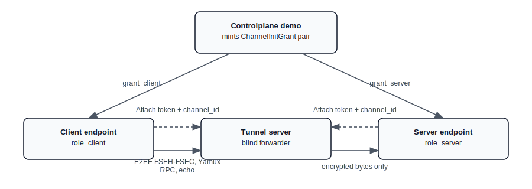
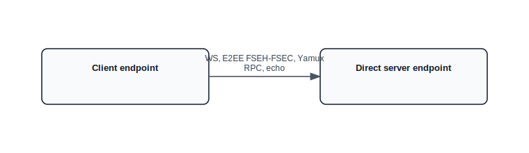

# flowersec

Flowersec is a Go + TypeScript data-plane library for building an end-to-end encrypted, multiplexed connection over WebSocket.

It provides a consistent protocol stack across Go and TypeScript (browser-friendly):

- Tunnel attach: authenticate + pair endpoints (`channel_id` + `role`) and then blindly forward bytes
- E2EE record layer: PSK-authenticated handshake and encrypted records (`FSEH` / `FSEC` framing)
- Multiplexing: Yamux over the encrypted byte stream (server endpoint is Yamux server)
- RPC/events: typed `type_id` routing on a dedicated `rpc` stream

Status: experimental; not audited.

## Repository Layout

- Go library and binaries: `go/`
- TypeScript library (ESM, browser-friendly): `ts/`
- Single-source IDL and codegen: `idl/`, `tools/idlgen/`
- Demos + scenario cookbook: `examples/README.md`

## Quickstart

The recommended hands-on entrypoint is the scenario cookbook:

```bash
open examples/README.md
```

It includes:

- Running the deployable tunnel server as an unmodified service
- Starting a minimal controlplane demo (issuer keys + grant minting)
- Starting a demo server endpoint (`role=server`) and connecting via TS/Go clients

## Key Concepts

- Endpoint roles: `client` vs `server` are protocol roles.
- One-time tokens: tunnel attach tokens are single-use; mint a fresh channel init for each attempt.
- Untrusted tunnel: the tunnel cannot decrypt or interpret application data after attach.
- Single-instance tunnel: token replay protection is in-memory; multi-instance deployments require a shared cache or equivalent.
- Handshake init_exp: `channel_init_expire_at` (init_exp) must be a non-zero Unix timestamp.

## Communication Scenarios

The examples in `examples/README.md` cover two common paths. The diagrams below mirror those scenarios.

### Tunnel path (controlplane + tunnel)



### Direct path (no tunnel)



## Development

Generate code from IDL:

```bash
make gen
```

Node.js version:

- Recommended: Node.js 22 (LTS). See `.nvmrc`.
- CI uses Node.js 22 (see `.github/workflows/ci.yml`).

Run formatting/lint and tests:

```bash
make lint
make test
```

## Observability

The tunnel binary exposes Prometheus metrics with a signal-based switch. Metrics are disabled by default and `/metrics` returns 404 until enabled.

- Enable metrics: send `SIGUSR1`
- Disable metrics: send `SIGUSR2`
- Endpoint: `GET /metrics` on the same HTTP server as the tunnel

Example:

```bash
# run tunnel
go run ./go/cmd/flowersec-tunnel \
  --listen 127.0.0.1:8080 \
  --issuer-keys-file /path/to/keys.json \
  --aud your-audience

# enable metrics
kill -USR1 <pid>

# scrape metrics
curl http://127.0.0.1:8080/metrics
```

Library integrations:

- Go tunnel: set `server.Config.Observer` if you run the server directly.
- Go RPC: attach an observer via `rpc.Server.SetObserver(...)` or `rpc.Client.SetObserver(...)`.
- TS client: pass `observer` into `connectTunnelClientRpc(...)`, `WebSocketBinaryTransport`, or `RpcClient`.

## Binaries

- Tunnel server (deployable): `go/cmd/flowersec-tunnel/`
  - flags: `--listen`, `--ws-path`, `--issuer-keys-file`, `--aud`
