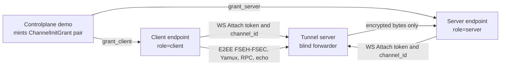

# flowersec

Flowersec is a Go + TypeScript data-plane library for building an end-to-end encrypted, multiplexed connection over WebSocket.

It provides a consistent protocol stack across Go and TypeScript (browser-friendly):

- Tunnel attach: authenticate + pair endpoints (`channel_id` + `role`) and then blindly forward bytes
- E2EE record layer: PSK-authenticated handshake and encrypted records (`FSEH` / `FSEC` framing)
- Multiplexing: Yamux over the encrypted byte stream (server endpoint is Yamux server)
- RPC/events: typed `type_id` routing on a dedicated `rpc` stream

Status: experimental; not audited.

## Repository Layout

- Go library and binaries: `go/`
- TypeScript library (ESM, browser-friendly): `ts/`
- Single-source IDL and codegen: `idl/`, `tools/idlgen/`
- Demos + scenario cookbook: `examples/README.md`

## Quickstart

The recommended hands-on entrypoint is the scenario cookbook:

```bash
open examples/README.md
```

It includes:

- Running the deployable tunnel server as an unmodified service
- Starting a minimal controlplane demo (issuer keys + grant minting)
- Starting a demo server endpoint (`role=server`) and connecting via TS/Go clients

## Key Concepts

- Endpoint roles: `client` vs `server` are protocol roles.
- One-time tokens: tunnel attach tokens are single-use; mint a fresh channel init for each attempt.
- Untrusted tunnel: the tunnel cannot decrypt or interpret application data after attach.
- Single-instance tunnel: token replay protection is in-memory; multi-instance deployments require a shared cache or equivalent.
- Handshake init_exp: `channel_init_expire_at` (init_exp) must be a non-zero Unix timestamp.

## Communication Scenarios

The examples in `examples/README.md` cover two common paths. The diagrams below mirror those scenarios.

### Tunnel path (controlplane + tunnel)



### Direct path (no tunnel)


## Development

Generate code from IDL:

```bash
make gen
```

Run formatting/lint and tests:

```bash
make lint
make test
```

## Binaries

- Tunnel server (deployable): `go/cmd/flowersec-tunnel/`
  - flags: `--listen`, `--ws-path`, `--issuer-keys-file`, `--aud`
