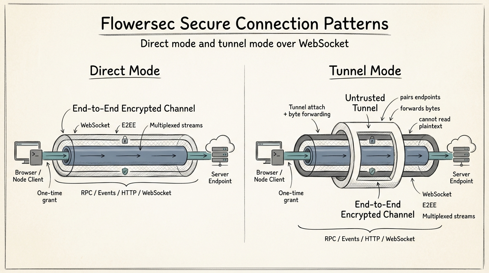

# flowersec

<p align="center">
  <strong>Secure remote apps, agents, and private services over a single end-to-end encrypted WebSocket session.</strong>
</p>

<p align="center">
  <a href="#run-demo">⚡ Run demos</a> |
  <a href="#connection-patterns">🧭 Modes</a> |
  <a href="#deploy">🚀 Deploy</a> |
  <a href="docs/FRONTEND_QUICKSTART.md">🌐 Browser quickstart</a> |
  <a href="docs/INTEGRATION_GUIDE.md">🧩 Integration guide</a> |
  <a href="#docs-map">📚 Docs map</a>
</p>


Flowersec is a Go + TypeScript toolkit for teams that want browser-friendly secure connectivity without giving relays access to application plaintext.

Use Flowersec when you want to:

- connect browsers or Node clients directly to a service, or through a relay
- preserve the familiar browser direct-access experience for end users
- keep tunnel operators blind to application payloads
- deploy your own tunnel instead of depending on a third-party tunnel service
- carry RPC, events, HTTP, and WebSocket traffic over one secure session
- deliver remote web experiences with a deployable tunnel server or proxy gateway

Status: experimental; not audited.

Security note: in any non-local deployment, use `wss://` (or terminate TLS at a reverse proxy). `ws://` exposes bearer tokens and metadata on the wire.

Stable integration entrypoints are documented in `docs/API_SURFACE.md`.
The stability rules, review checklist, and engineering gate model live in `docs/API_STABILITY_POLICY.md`.

## At a glance

| Need | Flowersec gives you |
| --- | --- |
| 🌐 Browser-friendly secure sessions | TypeScript clients for browsers and Node.js over WebSocket |
| 👤 Familiar browser UX | Remote apps still feel like normal browser-direct access with regular page loads, HTTP, and WebSocket behavior |
| 🔐 E2EE through relays | Direct mode and tunnel mode with encrypted payloads end-to-end |
| 🏗️ Own your tunnel layer | An open-source, self-hosted Flowersec tunnel server instead of a required third-party tunnel |
| 🧩 More than one protocol | RPC, events, custom streams, HTTP, and WebSocket over one multiplexed session |
| 🚀 Deployable building blocks | Tunnel server, proxy gateway, Go server endpoints, and helper CLIs |

## Quick links

| I want to... | Jump |
| --- | --- |
| ⚡ Try the demos | [`examples/README.md`](examples/README.md) |
| 🌐 Start from the browser SDK | [`docs/FRONTEND_QUICKSTART.md`](docs/FRONTEND_QUICKSTART.md) |
| 🧩 Integrate Flowersec into my app | [`docs/INTEGRATION_GUIDE.md`](docs/INTEGRATION_GUIDE.md) |
| 🧭 Understand API stability | [`docs/API_STABILITY_POLICY.md`](docs/API_STABILITY_POLICY.md) |
| 🚇 Deploy the tunnel | [`docs/TUNNEL_DEPLOYMENT.md`](docs/TUNNEL_DEPLOYMENT.md) |
| 🛡️ Deploy the proxy gateway | [`docs/PROXY_GATEWAY_DEPLOYMENT.md`](docs/PROXY_GATEWAY_DEPLOYMENT.md) |
| 🔐 Review trust boundaries | [`docs/THREAT_MODEL.md`](docs/THREAT_MODEL.md) |



## ✨ Why teams use Flowersec

- **Product-first secure access**: build browser-based remote experiences that feel like normal web apps, but run over an end-to-end encrypted channel.
- **Browser-native user experience**: for remote web apps, users stay in the familiar direct browser access model instead of switching to a tunnel-specific UX.
- **Direct or relayed connectivity**: connect straight to a server endpoint when you can, or use a tunnel when direct reachability is hard.
- **Encrypted payloads through relays**: in tunnel mode, the tunnel pairs endpoints and forwards bytes, but does not learn application plaintext.
- **Own the relay layer**: Flowersec ships an open-source tunnel you can deploy yourself, so you do not have to depend on a proprietary or third-party tunnel service.
- **One session, many flows**: run RPC, events, custom streams, HTTP, and WebSocket traffic over the same secure session.
- **Practical deployables**: ship with a browser-friendly TypeScript SDK, Go server endpoint APIs, a deployable tunnel server, and a deployable proxy gateway.

## 🧩 What you can build

- Browser-based agent consoles and operator tools
- Secure access to internal web apps without exposing them directly
- Real-time control planes with RPC calls and live notifications
- Browser-to-service encrypted channels for AI tools and internal platforms
- Full HTTP / WebSocket remote apps carried over Flowersec proxy streams

## 👤 What end users experience

1. Open a web app or operator console
2. Fetch a one-time grant or direct connect info
3. Connect directly to the server endpoint or through a tunnel
4. Establish an end-to-end encrypted, multiplexed session
5. Use the remote app through the familiar browser direct-access experience, with page loads, HTTP requests, and WebSocket updates behaving naturally

<a id="connection-patterns"></a>

## 🧭 Choose your connection pattern

- **Direct mode**
  - The client connects directly to the server WebSocket endpoint.
  - Best when the server endpoint is reachable and you want the shortest path.
  - The encrypted channel starts immediately after the WebSocket connection.

- **Tunnel mode**
  - The client and server endpoint attach to a tunnel with one-time grants.
  - Best when you need rendezvous, NAT-friendly connection setup, or a relay hop.
  - The tunnel forwards encrypted bytes; it does not terminate the end-to-end encrypted channel.
  - The relay is the included open-source Flowersec tunnel that you can self-host, rather than a required third-party tunnel dependency.

- **Proxy runtime mode**
  - A browser runtime plus Service Worker carries HTTP and WebSocket traffic over Flowersec proxy streams.
  - Best when you want a browser to use a remote web app through the encrypted session without putting an L7 plaintext gateway in the middle.

- **Proxy gateway mode**
  - A deployable gateway accepts browser HTTP / WebSocket traffic and forwards it to a Flowersec server endpoint.
  - Best when you need a browser-facing reverse proxy for remote apps.
  - Important: the gateway is plaintext at L7 by design; use runtime mode if you need the browser-to-server path to stay end-to-end encrypted through the relay layer.

<a id="run-demo"></a>

## ⚡ Try it in 5 minutes

The fastest way to feel the product is the demo bundle in GitHub Releases.

1. Download and extract `flowersec-demos_X.Y.Z_<os>_<arch>.tar.gz` (or `.zip`) from the `flowersec-go/vX.Y.Z` release.
2. From the extracted bundle root, start the demo dev server:

```bash
node ./examples/ts/dev-server.mjs | tee dev.json
```

3. Open the URLs printed in `dev.json`:

- `browser_tunnel_url`: fetch a one-time grant, then connect through the tunnel
- `browser_direct_url`: fetch direct connect info, then connect directly
- `browser_proxy_sandbox_url`: connect once, then open a proxied HTTP / WebSocket app

Full walkthrough: `examples/README.md`

## 🧪 Quickstart code

### Browser (recommended)

```ts
import { connectBrowser } from "@floegence/flowersec-core/browser";

const grant = await fetch("/api/flowersec/channel/init", { method: "POST" }).then((r) => r.json());

const client = await connectBrowser(grant);
await client.ping();
client.close();
```

### Node.js (recommended)

```ts
import { connectNode } from "@floegence/flowersec-core/node";

const grant = await fetch("https://your-app.example/api/flowersec/channel/init", { method: "POST" }).then((r) => r.json());

const client = await connectNode(grant, {
  origin: "https://your-app.example",
});

await client.ping();
client.close();
```

## 📦 Deployable pieces

| Piece | Runs where | What it gives you |
| --- | --- | --- |
| `@floegence/flowersec-core/browser` | Browser | High-level client helpers for direct and tunnel connects |
| `@floegence/flowersec-core/node` | Node.js | Node client helpers with correct Origin handling |
| `flowersec-go/client` | Go services / CLIs | High-level Go client APIs |
| `flowersec-go/endpoint` + `endpoint/serve` | Go server side | Server endpoints that terminate E2EE and serve streams / RPC |
| `flowersec-tunnel` | Deployable service | Open-source self-hosted rendezvous and byte forwarding for tunnel mode |
| `flowersec-proxy-gateway` | Deployable service | Browser-facing HTTP / WebSocket gateway over Flowersec proxy streams |
| helper tools | Local dev / controlplane workflows | Key generation, channel init grants, direct connect info |

<a id="deploy"></a>

## 🚀 Install and deploy

### TypeScript SDK

```bash
npm install @floegence/flowersec-core
```

No-clone install is also supported from GitHub Releases:

- download `floegence-flowersec-core-X.Y.Z.tgz`
- install with `npm i ./floegence-flowersec-core-X.Y.Z.tgz`

### Go SDK

```bash
go get github.com/floegence/flowersec/flowersec-go@latest
```

Versioning note: Go module tags are prefixed with `flowersec-go/` (for example, `flowersec-go/v0.2.0`).

### Tunnel server

Install:

```bash
go install github.com/floegence/flowersec/flowersec-go/cmd/flowersec-tunnel@latest
flowersec-tunnel --version
```

Minimal Docker deployment:

```bash
docker run --rm \
  -p 8080:8080 \
  -v "$PWD/issuer_keys.json:/etc/flowersec/issuer_keys.json:ro" \
  -e FSEC_TUNNEL_LISTEN=0.0.0.0:8080 \
  -e FSEC_TUNNEL_WS_PATH=/ws \
  -e FSEC_TUNNEL_ISSUER_KEYS_FILE=/etc/flowersec/issuer_keys.json \
  -e FSEC_TUNNEL_AUD=flowersec-tunnel:prod \
  -e FSEC_TUNNEL_ISS=issuer-prod \
  -e FSEC_TUNNEL_ALLOW_ORIGIN=https://your-web-origin.example \
  ghcr.io/floegence/flowersec-tunnel:latest
```

Notes:

- `issuer_keys.json` is the tunnel verifier public keyset from your controlplane
- `GET /healthz` is the built-in health check
- Flowersec ships this tunnel as an open-source component you can deploy yourself; no third-party tunnel service is required
- multi-tenant deployments can use `FSEC_TUNNEL_TENANTS_FILE`

Full deployment guide: `docs/TUNNEL_DEPLOYMENT.md`

### Proxy gateway

Install:

```bash
go install github.com/floegence/flowersec/flowersec-go/cmd/flowersec-proxy-gateway@latest
flowersec-proxy-gateway --version
```

Minimal Docker deployment:

```bash
docker run --rm \
  -p 8080:8080 \
  -v "$PWD/gateway.json:/etc/flowersec/gateway.json:ro" \
  -v "$PWD/grants:/etc/flowersec/grants:ro" \
  -e FSEC_PROXY_GATEWAY_CONFIG=/etc/flowersec/gateway.json \
  ghcr.io/floegence/flowersec-proxy-gateway:latest
```

Notes:

- `GET /_flowersec/healthz` is the built-in health check
- route matching is host-only after canonicalization
- grants are one-time; each route must fetch or mint fresh `grant_client` values for reconnects

Full deployment guide: `docs/PROXY_GATEWAY_DEPLOYMENT.md`

### Helper tools

Install:

```bash
go install github.com/floegence/flowersec/flowersec-go/cmd/flowersec-issuer-keygen@latest
go install github.com/floegence/flowersec/flowersec-go/cmd/flowersec-channelinit@latest
go install github.com/floegence/flowersec/flowersec-go/cmd/flowersec-directinit@latest
```

What they do:

- `flowersec-issuer-keygen`: writes an issuer private key plus a public keyset for the tunnel
- `flowersec-channelinit`: mints a one-time `ChannelInitGrant` pair
- `flowersec-directinit`: generates `DirectConnectInfo` JSON for direct demos

The `flowersec-tools_X.Y.Z_<os>_<arch>` release bundle includes these tools and `flowersec-proxy-gateway`.

### CLI conventions

All user-facing Flowersec CLIs (`flowersec-tunnel`, `flowersec-proxy-gateway`, `flowersec-issuer-keygen`, `flowersec-channelinit`, `flowersec-directinit`, `idlgen`) follow these conventions:

- `--help` includes copy/paste examples and the output contract
- exit codes: `0` success, `2` usage error, `1` runtime error
- JSON-producing tools write machine-readable JSON to stdout and logs/errors to stderr
- most flags support `FSEC_*` environment variable defaults

## 🔐 Security and operational notes

- **One-time grants**: tunnel attach tokens are single-use; mint a fresh channel init for every new connection attempt.
- **Untrusted tunnel**: in tunnel mode, the tunnel can pair endpoints and forward bytes, but it cannot decrypt application payloads after the encrypted session is established.
- **Use `wss://` in production**: the attach layer is plaintext before E2EE starts, so production deployments must use TLS.
- **Origin checks matter**: browser-facing Origin allow-lists are enabled by default on the tunnel and direct servers.
- **Direct mode is simpler when reachable**: use it when the server endpoint can be reached directly and you do not need a relay hop.
- **Runtime vs gateway boundary**: runtime proxy mode keeps the browser-to-server path end-to-end encrypted through the relay layer; gateway mode is a deliberate L7 plaintext component.
- **Tunnel scaling**: replay protection and pairing state are in memory by default; for multi-instance scale without shared state, shard channels across tunnel URLs at the controlplane layer.
- **Observability**: the tunnel exposes Prometheus metrics and optional bandwidth stats. See `docs/TUNNEL_DEPLOYMENT.md` and the observability notes below.

<a id="docs-map"></a>

## 📚 Docs map

- Frontend quickstart: `docs/FRONTEND_QUICKSTART.md`
- Integration guide: `docs/INTEGRATION_GUIDE.md`
- API surface: `docs/API_SURFACE.md`
- Tunnel deployment: `docs/TUNNEL_DEPLOYMENT.md`
- Proxy gateway deployment: `docs/PROXY_GATEWAY_DEPLOYMENT.md`
- Proxy stream contract: `docs/PROXY.md`
- Threat model: `docs/THREAT_MODEL.md`
- Protocol framing: `docs/PROTOCOL.md`
- Error model: `docs/ERROR_MODEL.md`
- Demo cookbook: `examples/README.md`

## 🗂️ Repository layout

- Go library and deployable binaries: `flowersec-go/`
- TypeScript library (ESM, browser-friendly): `flowersec-ts/`
- Demos and scenarios: `examples/`
- Single-source IDL and codegen: `idl/`, `tools/idlgen/`

## 🧪 Development

Prerequisites:

- Go `1.25.8+`
- Node.js `22` LTS recommended (see `.nvmrc`)

Generate code from IDL:

```bash
make gen
```

Available codegen targets:

- `make gen-core`: stable protocol IDLs
- `make gen-examples`: example and test-only IDLs
- `make gen`: both

Run the full local gate:

```bash
make check
```

Observability quick notes:

- Prometheus metrics are served from a dedicated metrics server when `--metrics-listen` is set
- optional bandwidth stats are served from `/stats/v1/bandwidth` when `--stats-listen` is set
- metrics can be toggled at runtime with `SIGUSR1` / `SIGUSR2`

Go workspace notes:

- core Go code lives in `flowersec-go/`
- examples live in `examples/`
- run Go commands from those directories, or use the root `Makefile`
