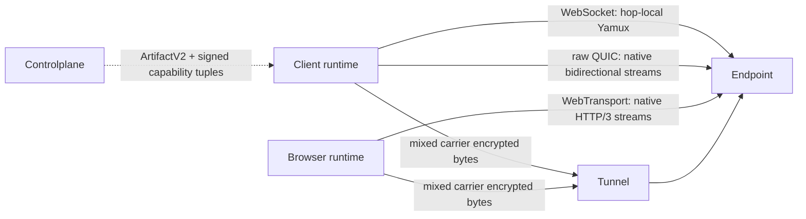

# Flowersec

<!-- readme-locales:start -->
<p align="center">
  <a href="README.md">English</a> |
  <a href="README.zh-CN.md">简体中文</a> |
  <a href="README.zh-TW.md">繁體中文</a> |
  <a href="README.ja-JP.md">日本語</a> |
  <a href="README.ko-KR.md">한국어</a> |
  <a href="README.de-DE.md">Deutsch</a> |
  <a href="README.fr-FR.md">Français</a> |
  <a href="README.es-ES.md">Español</a> |
  <strong>Português do Brasil</strong> |
  <a href="README.ru-RU.md">Русский</a>
</p>
<!-- readme-locales:end -->

<p align="center">
  <strong>Comunicação criptografada de ponta a ponta, implementada de forma consistente em Go, TypeScript, Swift e Rust.</strong>
</p>

<p align="center">
  Crie conexões seguras entre navegadores, Agents e serviços. Transporte RPC, eventos, fluxos de bytes, HTTP e WebSocket em uma única sessão direta ou com relay, sem expor ao relay o texto em claro da aplicação.
</p>

<p align="center">
  <a href="#try-it-locally">Experimentar</a> |
  <a href="#sdks-and-cookbooks">Cookbooks</a> |
  <a href="#portable-contract">SDKs</a> |
  <a href="#security">Segurança</a> |
  <a href="#deploy-and-develop">Implantar</a>
</p>

[](https://github.com/floegence/flowersec/releases/latest)
[](LICENSE)


<!-- readme-section:why-flowersec -->
<a id="why-flowersec"></a>

## Por que Flowersec

- **Um único contrato portátil.** Go, TypeScript, Swift e Rust implementam o mesmo formato de rede e o mesmo comportamento de segurança, sessão, RPC, Endpoint, Controlplane, reconexão, proxy e observabilidade.
- **Caminhos neutros ao Carrier.** Transport v2 trata WebSocket, raw QUIC e WebTransport como Carriers equivalentes. Capacidades Runtime exatas e política de produto escolhem candidatos, sem protocolo primário ou fallback permanente.
- **Uma sessão, vários fluxos.** Multiplexe chamadas RPC, eventos, fluxos de bytes personalizados, requisições HTTP e tráfego WebSocket sobre a mesma conexão criptografada.
- **Os componentes necessários estão incluídos.** O Flowersec fornece APIs Endpoint nativas, um Browser Runtime TypeScript, um Tunnel de código aberto, um Proxy Gateway e CLIs operacionais.

Casos de uso comuns incluem Agents remotos, serviços privados, ferramentas Web internas, consoles operacionais no navegador e Controlplanes em tempo real.

<!-- readme-section:how-it-works -->
<a id="how-it-works"></a>

## Como funciona

| Caminho | Formato da conexão | Limite de confiança |
| --- | --- | --- |
| Direct | O cliente se conecta a um Endpoint de servidor acessível | Cliente e Endpoint encerram E2EE; nenhuma Controlplane online é necessária no caminho de dados |
| Tunnel | Cliente e Endpoint se conectam ao mesmo Tunnel com Grants de uso único | A Controlplane prepara a conexão; o Tunnel associa as pontas e encaminha bytes criptografados |
| Browser proxy | Um Browser Runtime ou Gateway transporta HTTP e WebSocket por Flowersec Streams | O modo Runtime preserva E2EE até o Endpoint; o modo Gateway confia deliberadamente ao Gateway o texto em claro L7 |

A Controlplane participa apenas da preparação da conexão. Ela emite ConnectArtifacts e Grants, mas não fica no caminho dos dados da aplicação criptografados de ponta a ponta.



Transport v2 treats WebSocket, raw QUIC, and WebTransport as equal carrier classes. WebSocket keeps hop-local Yamux; raw QUIC and WebTransport use native bidirectional streams and disable 0-RTT and QUIC DATAGRAM. The exact runtime support matrix and breaking lifecycle migration are maintained in the [Transport v2 architecture](docs/TRANSPORT_V2_ARCHITECTURE.md) and [migration guide](docs/MIGRATION_TRANSPORT_V2.md).

<!-- readme-section:try-it-locally -->
<a id="try-it-locally"></a>

## Experimentar localmente

A partir de um checkout do código-fonte, compile o pacote TypeScript e inicie a Demo Stack compartilhada:

```bash
make ts-ensure-deps ts-build
node ./examples/ts/dev-server.mjs | tee dev.json
```

O JSON gerado contém URLs de navegador para Direct, Tunnel e Proxy Runtime de ponta a ponta, além da URL da Controlplane usada pelos exemplos de SDK nativos. Os Release Demo Bundles incluem os binários necessários e o pacote TypeScript pré-compilado.

Consulte o [índice de Cookbooks](examples/README.md) para os comandos exatos de Go, TypeScript, Swift e Rust.

<!-- readme-section:sdks-and-cookbooks -->
<a id="sdks-and-cookbooks"></a>

## SDKs e Cookbooks

| Linguagem | Pacote e instalação | Cookbook |
| --- | --- | --- |
| Go | `go get github.com/floegence/flowersec/flowersec-go/v2@latest` | [Go](examples/go/README.md) |
| TypeScript | `npm install @floegence/flowersec-core` | [TypeScript](examples/ts/README.md) |
| Swift | Produto SwiftPM `Flowersec` | [Swift](examples/swift/README.md) |
| Rust | `cargo add flowersec` | [Rust](examples/rust/README.md) |

Novas integrações seguem um único caminho independente de linguagem:

```text
ArtifactV2 -> equal candidate selection -> authenticated SessionV2 -> RPC / stream / proxy
```

Os Cookbooks apontam diretamente para código executável, em vez de duplicar grandes exemplos de API em vários documentos.

<!-- readme-section:portable-contract -->
<a id="portable-contract"></a>

## Contrato portátil

| Capacidade | Go | TypeScript | Swift | Rust |
| --- | :---: | :---: | :---: | :---: |
| Sessões Client e Endpoint | Sim | Sim | Sim | Sim |
| RPC, eventos e Streams personalizados | Sim | Sim | Sim | Sim |
| Artifacts de Controlplane e reconexão | Sim | Sim | Sim | Sim |
| Contrato Proxy HTTP e WebSocket | Sim | Sim | Sim | Sim |
| Diagnósticos compartilhados e limites de recursos | Sim | Sim | Sim | Sim |

As responsabilidades específicas de Runtime são explícitas: TypeScript mantém a integração Browser e Service Worker; Go mantém o Tunnel compartilhado, o Proxy Gateway e as CLIs; Swift e Rust fornecem integração SDK nativa sem duplicar esses componentes.

A interoperabilidade é verificada continuamente nas duas direções com o Go Reference Client/Server para TypeScript, Swift e Rust, cobrindo Direct, Tunnel, RPC, Streams, Liveness, Rekey, Reset e tráfego Proxy.

A tabela acima descreve as capacidades portáteis do Transport v1. As capacidades de rede de produção do Transport v2 seguem Runtime Tuples exatos.

| Transport v2 capability | Go | TypeScript | Swift | Rust |
| --- | :---: | :---: | :---: | :---: |
| WebSocket carrier | Yes | Browser: Yes / Node: No | No | No |
| raw QUIC carrier | Yes | No | No | Tested adapter; not advertised |
| WebTransport carrier | Yes | Browser: Yes / Node: No | No | No |

O smoke local de Transport v2 não é aprovação de produção entre linguagens. A release exige Evidence assinada de navegador real, rede fraca, qlog, migração e desempenho. A CLI `flowersec-tunnel` e os binários Cookbook atuais continuam Transport v1.

<!-- readme-section:security -->
<a id="security"></a>

## Segurança

- Conexões de alto nível exigem `wss://` por padrão. O desenvolvimento local com `ws://` requer uma Loopback Policy explícita.
- Tunnel Grants são de uso único. Uma reconexão deve obter um novo `ConnectArtifact` ou Grant.
- Após o handshake E2EE, o Tunnel não pode descriptografar os dados da aplicação. TLS ainda protege os metadados de conexão e Bearer Tokens anteriores a E2EE.
- O modo Browser Runtime preserva E2EE através do relay. O Proxy Gateway é deliberadamente um componente L7 confiável.

Antes do uso em produção, revise o [modelo de ameaças](docs/THREAT_MODEL.md), o [protocolo](docs/PROTOCOL.md) e o [modelo de erros](docs/ERROR_MODEL.md).

<!-- readme-section:deploy-and-develop -->
<a id="deploy-and-develop"></a>

## Implantação e desenvolvimento

Guias de implantação:

- [Auto-hospedar o Tunnel](docs/TUNNEL_DEPLOYMENT.md)
- [Implantar o Proxy Gateway](docs/PROXY_GATEWAY_DEPLOYMENT.md)

Estrutura do repositório:

- `flowersec-go/`, `flowersec-ts/`, `flowersec-swift/`, `flowersec-rust/`: SDKs por linguagem
- `examples/`: Cookbooks executáveis e Demo Stack compartilhada
- `idl/`: definições de protocolo compartilhadas e entradas de contratos gerados
- `docs/`: contratos duradouros de protocolo, segurança, interoperabilidade e implantação

Instale os Hooks gerenciados pelo repositório uma vez em cada Worktree e execute a verificação local completa antes da integração:

```bash
make install-hooks
make check
```

O Flowersec é distribuído sob a [MIT License](LICENSE). Pacotes, binários, imagens e Release Notes publicados estão disponíveis em [GitHub Releases](https://github.com/floegence/flowersec/releases).
