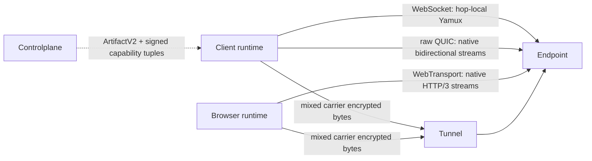

# Flowersec

<!-- readme-locales:start -->
<p align="center">
  <a href="README.md">English</a> |
  <a href="README.zh-CN.md">简体中文</a> |
  <a href="README.zh-TW.md">繁體中文</a> |
  <a href="README.ja-JP.md">日本語</a> |
  <a href="README.ko-KR.md">한국어</a> |
  <a href="README.de-DE.md">Deutsch</a> |
  <a href="README.fr-FR.md">Français</a> |
  <a href="README.es-ES.md">Español</a> |
  <a href="README.pt-BR.md">Português do Brasil</a> |
  <strong>Русский</strong>
</p>
<!-- readme-locales:end -->

<p align="center">
  <strong>Сквозное шифрование связи с единообразной реализацией на Go, TypeScript, Swift и Rust.</strong>
</p>

<p align="center">
  Создавайте защищённые соединения между браузерами, Agents и сервисами. Передавайте RPC, события, потоки байтов, HTTP и WebSocket в одной прямой или ретранслируемой сессии, не раскрывая relay открытые данные приложения.
</p>

<p align="center">
  <a href="#try-it-locally">Попробовать</a> |
  <a href="#sdks-and-cookbooks">Cookbooks</a> |
  <a href="#portable-contract">SDK</a> |
  <a href="#security">Безопасность</a> |
  <a href="#deploy-and-develop">Развёртывание</a>
</p>

[](https://github.com/floegence/flowersec/releases/latest)
[](LICENSE)


<!-- readme-section:why-flowersec -->
<a id="why-flowersec"></a>

## Зачем нужен Flowersec

- **Единый переносимый контракт.** Go, TypeScript, Swift и Rust реализуют одинаковый сетевой формат и одинаковое поведение безопасности, сессий, RPC, Endpoint, Controlplane, переподключения, proxy и наблюдаемости.
- **Независимые от Carrier пути.** Transport v2 считает WebSocket, raw QUIC и WebTransport равноправными Carrier. Кандидатов выбирают точные возможности Runtime и политика продукта; постоянного основного или fallback-протокола нет.
- **Одна сессия, множество потоков.** Объединяйте вызовы RPC, события, пользовательские потоки байтов, HTTP-запросы и трафик WebSocket в одном зашифрованном соединении.
- **Необходимые компоненты включены.** Flowersec предоставляет нативные API Endpoint, TypeScript Browser Runtime, открытый Tunnel, Proxy Gateway и эксплуатационные CLI.

Типичные сценарии: удалённые Agents, приватные сервисы, внутренние Web-инструменты, браузерные панели операторов и Controlplanes реального времени.

<!-- readme-section:how-it-works -->
<a id="how-it-works"></a>

## Как это работает

| Путь | Схема соединения | Граница доверия |
| --- | --- | --- |
| Direct | Клиент подключается к доступному серверному Endpoint | Клиент и Endpoint завершают E2EE; онлайн-Controlplane не требуется в пути данных |
| Tunnel | Клиент и Endpoint присоединяются к одному Tunnel с одноразовыми Grants | Controlplane подготавливает соединение; Tunnel сопоставляет стороны и пересылает зашифрованные байты |
| Browser proxy | Browser Runtime или Gateway передаёт HTTP и WebSocket через Flowersec Streams | Режим Runtime сохраняет E2EE до Endpoint; режим Gateway намеренно доверяет Gateway открытые данные уровня L7 |

Controlplane участвует только в подготовке соединения. Она выдаёт ConnectArtifacts и Grants, но не находится в пути сквозно зашифрованных данных приложения.



Transport v2 treats WebSocket, raw QUIC, and WebTransport as equal carrier classes. WebSocket keeps hop-local Yamux; raw QUIC and WebTransport use native bidirectional streams and disable 0-RTT and QUIC DATAGRAM. The exact runtime support matrix and breaking lifecycle migration are maintained in the [Transport v2 architecture](docs/TRANSPORT_V2_ARCHITECTURE.md) and [migration guide](docs/MIGRATION_TRANSPORT_V2.md).

<!-- readme-section:try-it-locally -->
<a id="try-it-locally"></a>

## Локальный запуск

Из рабочей копии исходного кода соберите пакет TypeScript и запустите общую Demo Stack:

```bash
make ts-ensure-deps ts-build
node ./examples/ts/dev-server.mjs | tee dev.json
```

Сформированный JSON содержит браузерные URL для Direct, Tunnel и сквозного Proxy Runtime, а также URL Controlplane для примеров нативных SDK. Release Demo Bundles уже включают необходимые бинарные файлы и собранный пакет TypeScript.

Точные команды для Go, TypeScript, Swift и Rust приведены в [индексе Cookbooks](examples/README.md).

<!-- readme-section:sdks-and-cookbooks -->
<a id="sdks-and-cookbooks"></a>

## SDK и Cookbooks

| Язык | Пакет и установка | Cookbook |
| --- | --- | --- |
| Go | `go get github.com/floegence/flowersec/flowersec-go/v2@latest` | [Go](examples/go/README.md) |
| TypeScript | `npm install @floegence/flowersec-core` | [TypeScript](examples/ts/README.md) |
| Swift | Продукт SwiftPM `Flowersec` | [Swift](examples/swift/README.md) |
| Rust | `cargo add flowersec` | [Rust](examples/rust/README.md) |

Новые интеграции используют единый путь, не зависящий от языка:

```text
ArtifactV2 -> equal candidate selection -> authenticated SessionV2 -> RPC / stream / proxy
```

Cookbooks ссылаются непосредственно на исполняемый исходный код, не дублируя большие примеры API в нескольких документах.

<!-- readme-section:portable-contract -->
<a id="portable-contract"></a>

## Переносимый контракт

| Возможность | Go | TypeScript | Swift | Rust |
| --- | :---: | :---: | :---: | :---: |
| Сессии Client и Endpoint | Да | Да | Да | Да |
| RPC, события и пользовательские Streams | Да | Да | Да | Да |
| Artifacts Controlplane и переподключение | Да | Да | Да | Да |
| Контракт Proxy для HTTP и WebSocket | Да | Да | Да | Да |
| Общая диагностика и ограничения ресурсов | Да | Да | Да | Да |

Ответственность за Runtime-компоненты определена явно: TypeScript отвечает за интеграцию Browser и Service Worker; Go — за общий Tunnel, Proxy Gateway и CLI; Swift и Rust предоставляют нативные SDK без дублирования этих компонентов.

Совместимость непрерывно проверяется в обоих направлениях с Go Reference Client/Server для TypeScript, Swift и Rust, включая Direct, Tunnel, RPC, Streams, Liveness, Rekey, Reset и Proxy-трафик.

Таблица выше описывает переносимые возможности Transport v1. Сетевые возможности Transport v2 для production определяются точными Runtime Tuples.

| Transport v2 capability | Go | TypeScript | Swift | Rust |
| --- | :---: | :---: | :---: | :---: |
| WebSocket carrier | Yes | Browser: Yes / Node: No | No | No |
| raw QUIC carrier | Yes | No | No | Tested adapter; not advertised |
| WebTransport carrier | Yes | Browser: Yes / Node: No | No | No |

Локальный smoke Transport v2 не является межъязычным production sign-off. Для release нужны подписанные Evidence реального браузера, слабой сети, qlog, миграции и производительности. CLI `flowersec-tunnel` и текущие Cookbook Binary остаются Transport v1.

<!-- readme-section:security -->
<a id="security"></a>

## Безопасность

- Высокоуровневые соединения по умолчанию требуют `wss://`. Для локальной разработки с `ws://` нужна явная Loopback Policy.
- Tunnel Grants одноразовые. Для переподключения требуется новый `ConnectArtifact` или Grant.
- После E2EE-handshake Tunnel не может расшифровать данные приложения. TLS по-прежнему защищает метаданные подключения и Bearer Tokens до E2EE.
- Режим Browser Runtime сохраняет E2EE через relay. Proxy Gateway по дизайну является доверенным компонентом L7.

Перед промышленным использованием изучите [модель угроз](docs/THREAT_MODEL.md), [протокол](docs/PROTOCOL.md) и [модель ошибок](docs/ERROR_MODEL.md).

<!-- readme-section:deploy-and-develop -->
<a id="deploy-and-develop"></a>

## Развёртывание и разработка

Руководства по развёртыванию:

- [Самостоятельный запуск Tunnel](docs/TUNNEL_DEPLOYMENT.md)
- [Развёртывание Proxy Gateway](docs/PROXY_GATEWAY_DEPLOYMENT.md)

Структура репозитория:

- `flowersec-go/`, `flowersec-ts/`, `flowersec-swift/`, `flowersec-rust/`: SDK для языков
- `examples/`: исполняемые Cookbooks и общая Demo Stack
- `idl/`: общие определения протокола и входы для генерируемых контрактов
- `docs/`: долгосрочные контракты протокола, безопасности, совместимости и развёртывания

Установите управляемые репозиторием Hooks один раз в каждом Worktree, затем выполните полную локальную проверку перед интеграцией:

```bash
make install-hooks
make check
```

Flowersec распространяется по [MIT License](LICENSE). Опубликованные пакеты, бинарные файлы, образы и Release Notes доступны в [GitHub Releases](https://github.com/floegence/flowersec/releases).
