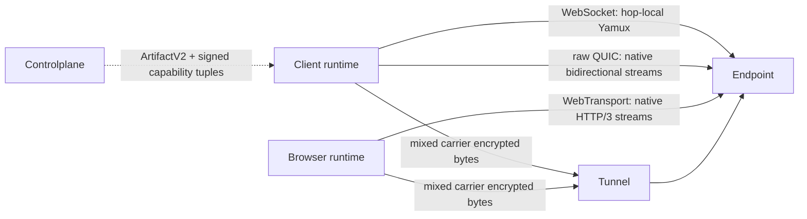

# Flowersec

<!-- readme-locales:start -->
<p align="center">
  <a href="README.md">English</a> |
  <a href="README.zh-CN.md">简体中文</a> |
  <strong>繁體中文</strong> |
  <a href="README.ja-JP.md">日本語</a> |
  <a href="README.ko-KR.md">한국어</a> |
  <a href="README.de-DE.md">Deutsch</a> |
  <a href="README.fr-FR.md">Français</a> |
  <a href="README.es-ES.md">Español</a> |
  <a href="README.pt-BR.md">Português do Brasil</a> |
  <a href="README.ru-RU.md">Русский</a>
</p>
<!-- readme-locales:end -->

<p align="center">
  <strong>在 Go、TypeScript、Swift 與 Rust 中一致實作的端對端加密通訊。</strong>
</p>

<p align="center">
  在瀏覽器、Agent 與服務之間建立安全連線。透過單一直接或中繼會話承載 RPC、事件、位元組串流、HTTP 與 WebSocket，同時避免中繼接觸應用程式明文。
</p>

<p align="center">
  <a href="#try-it-locally">立即體驗</a> |
  <a href="#sdks-and-cookbooks">Cookbook</a> |
  <a href="#portable-contract">SDK</a> |
  <a href="#security">安全</a> |
  <a href="#deploy-and-develop">部署</a>
</p>

[](https://github.com/floegence/flowersec/releases/latest)
[](LICENSE)


<!-- readme-section:why-flowersec -->
<a id="why-flowersec"></a>

## 為什麼選擇 Flowersec

- **一套可攜式契約。** Go、TypeScript、Swift 與 Rust 共用相同的線上協定、安全、會話、RPC、Endpoint、Controlplane、重新連線、代理與可觀測性行為。
- **Carrier 中立路徑。** Transport v2 將 WebSocket、raw QUIC 與 WebTransport 視為同等 Carrier；由精確 Runtime 能力和產品策略選擇候選，不設永久主協定或回退協定。
- **一個會話，多種資料流。** 在同一加密連線上多工處理 RPC 呼叫、事件、自訂位元組串流、HTTP 請求與 WebSocket 流量。
- **提供完整基礎元件。** Flowersec 包含原生 Endpoint API、TypeScript 瀏覽器 Runtime、開源 Tunnel、Proxy Gateway 與維運 CLI。

典型用途包括遠端 Agent、私有服務、內部 Web 工具、瀏覽器維運主控台與即時控制平面。

<!-- readme-section:how-it-works -->
<a id="how-it-works"></a>

## 運作方式

| 路徑 | 連線方式 | 信任邊界 |
| --- | --- | --- |
| Direct | 用戶端連線至可存取的伺服器 Endpoint | 用戶端與 Endpoint 終止 E2EE；資料路徑不需要線上 Controlplane |
| Tunnel | 用戶端與 Endpoint 使用一次性 Grant 接入同一個 Tunnel | Controlplane 準備連線；Tunnel 負責配對並轉送加密位元組 |
| Browser proxy | 瀏覽器 Runtime 或 Gateway 透過 Flowersec Stream 承載 HTTP 與 WebSocket | Runtime 模式維持瀏覽器到 Endpoint 的 E2EE；Gateway 模式刻意讓 Gateway 處理 L7 明文 |

Controlplane 只參與連線準備。它簽發 ConnectArtifact 與 Grant，但不進入端對端加密的應用程式資料路徑。



Transport v2 treats WebSocket, raw QUIC, and WebTransport as equal carrier classes. WebSocket keeps hop-local Yamux; raw QUIC and WebTransport use native bidirectional streams and disable 0-RTT and QUIC DATAGRAM. The exact runtime support matrix and breaking lifecycle migration are maintained in the [Transport v2 architecture](docs/TRANSPORT_V2_ARCHITECTURE.md) and [migration guide](docs/MIGRATION_TRANSPORT_V2.md).

<!-- readme-section:try-it-locally -->
<a id="try-it-locally"></a>

## 本機體驗

在原始碼工作區中建置 TypeScript 套件並啟動共用 Demo Stack：

```bash
make ts-ensure-deps ts-build
node ./examples/ts/dev-server.mjs | tee dev.json
```

啟動後產生的 JSON 包含 Direct、Tunnel、端對端 Proxy Runtime 的瀏覽器網址，以及原生 SDK 範例使用的 Controlplane 網址。Release Demo Bundle 已包含必要的二進位檔與預先建置的 TypeScript 套件。

完整的 Go、TypeScript、Swift 與 Rust 指令請參閱 [Cookbook 索引](examples/README.md)。

<!-- readme-section:sdks-and-cookbooks -->
<a id="sdks-and-cookbooks"></a>

## SDK 與 Cookbook

| 語言 | 套件與安裝方式 | Cookbook |
| --- | --- | --- |
| Go | `go get github.com/floegence/flowersec/flowersec-go@latest` | [Go](examples/go/README.md) |
| TypeScript | `npm install @floegence/flowersec-core` | [TypeScript](examples/ts/README.md) |
| Swift | SwiftPM 產品 `Flowersec` | [Swift](examples/swift/README.md) |
| Rust | `cargo add flowersec` | [Rust](examples/rust/README.md) |

所有新整合都遵循相同且與語言無關的路徑：

```text
ArtifactV2 -> equal candidate selection -> authenticated SessionV2 -> RPC / stream / proxy
```

Cookbook 直接連結可執行原始碼，避免在多份文件中重複維護大型 API 範例。

<!-- readme-section:portable-contract -->
<a id="portable-contract"></a>

## 跨語言契約

| 能力 | Go | TypeScript | Swift | Rust |
| --- | :---: | :---: | :---: | :---: |
| Client 與 Endpoint 會話 | 支援 | 支援 | 支援 | 支援 |
| RPC、事件與自訂 Stream | 支援 | 支援 | 支援 | 支援 |
| Controlplane Artifact 與重新連線 | 支援 | 支援 | 支援 | 支援 |
| HTTP 與 WebSocket Proxy 契約 | 支援 | 支援 | 支援 | 支援 |
| 共用診斷與資源限制 | 支援 | 支援 | 支援 | 支援 |

執行階段職責保持明確：TypeScript 負責 Browser 與 Service Worker 整合；Go 負責共用 Tunnel、Proxy Gateway 與 CLI；Swift 與 Rust 提供原生 SDK 整合，不重複實作這些特定執行階段元件。

互通性會透過 Go Reference Client/Server 持續驗證 TypeScript、Swift 與 Rust 的雙向連線，涵蓋 Direct、Tunnel、RPC、Stream、Liveness、Rekey、Reset 與 Proxy 流量。

上表描述 Transport v1 的跨語言能力。Transport v2 的生產網路能力以精確 Runtime Tuple 為準：

| Transport v2 能力 | Go | TypeScript | Swift | Rust |
| --- | :---: | :---: | :---: | :---: |
| WebSocket Carrier | 支援 | Browser 支援 / Node 不支援 | 不支援 | 不支援 |
| raw QUIC Carrier | 支援 | 不支援 | 不支援 | 已測試 Adapter，不對外宣告 |
| WebTransport Carrier | 支援 | Browser 支援 / Node 不支援 | 不支援 | 不支援 |

Transport v2 的本機 Smoke 不等於跨語言生產簽發；發布還需要真實瀏覽器、弱網、qlog、遷移與效能簽名 Evidence。`flowersec-tunnel` CLI 和目前 Cookbook Binary 仍為 Transport v1。

<!-- readme-section:security -->
<a id="security"></a>

## 安全

- 高階連線預設要求 `wss://`。本機 `ws://` 開發必須明確啟用 Loopback Policy。
- Tunnel Grant 只能使用一次。重新連線必須取得新的 `ConnectArtifact` 或 Grant。
- E2EE 交握完成後 Tunnel 無法解密應用程式載荷，但仍需要 TLS 保護交握前的接入中繼資料與 Bearer Token。
- Browser Runtime 模式在中繼鏈路上維持 E2EE；Proxy Gateway 依設計屬於可信任的 L7 元件。

正式使用前請閱讀[威脅模型](docs/THREAT_MODEL.md)、[協定](docs/PROTOCOL.md)與[錯誤模型](docs/ERROR_MODEL.md)。

<!-- readme-section:deploy-and-develop -->
<a id="deploy-and-develop"></a>

## 部署與開發

部署指南：

- [自行架設 Tunnel](docs/TUNNEL_DEPLOYMENT.md)
- [部署 Proxy Gateway](docs/PROXY_GATEWAY_DEPLOYMENT.md)

儲存庫結構：

- `flowersec-go/`、`flowersec-ts/`、`flowersec-swift/`、`flowersec-rust/`：各語言 SDK
- `examples/`：可執行 Cookbook 與共用 Demo Stack
- `idl/`：共用協定定義與產生契約的輸入
- `docs/`：長期維護的協定、安全、互通性與部署契約

每個 Worktree 只需安裝一次儲存庫 Hooks，並在整合前執行完整本機門檻：

```bash
make install-hooks
make check
```

Flowersec 採用 [MIT License](LICENSE)。已發布的套件、二進位檔、映像檔與 Release Notes 可從 [GitHub Releases](https://github.com/floegence/flowersec/releases) 取得。
